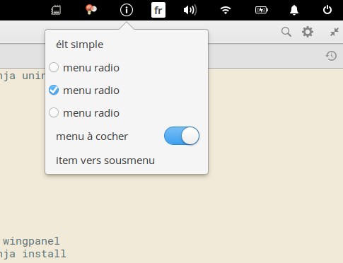

# Wingpanel Ayatana-Compatibility Indicator (Community Version)
<h1>Description:</h1>
Keep compatibility with ubuntu/unity indicators on Elementary OS wingpanel.
If you want to install applications with indicators like weather forecast, redshift... this plug-in 
let these indicators appear in your panel. 

 

<h1>Installation</h1>
1.Download the last release (zip) and extract files 

<h2>Dependencies</h2>

2.You'll need the following dependencies to build :

<pre>sudo apt-get install libglib2.0-dev libgranite-dev libindicator3-dev 
sudo apt-get install libwingpanel-2.0-dev valac gcc meson </pre/>

<h2>Build with meson</h2>

3.Open a Terminal in the extracted folder, build your application with meson and install it with ninja: 

<pre>meson build --prefix=/usr
cd build
ninja
sudo ninja install
</pre>

<h2>Parameters for Pantheon (eos)</h2>
4.You need to add Pantheon to the list of desktops, that can work with indicators:
<pre>sudo nano /etc/xdg/autostart/indicator-application.desktop</pre>
Search the parameter: OnlyShowIn= and add "Pantheon" at the end of the line : 
<pre>OnlyShowIn=Unity;GNOME;Pantheon;</pre>
Save your changes and reload your panel:
<pre>killall wingpanel</pre>

<h1>uninstall</h1>
Open a terminal in the build folder.
<pre>sudo ninja uninstall
killall wingpanel
</pre>
